+++
title = 'Canonball'
date = 2023-10-04T12:52:34-04:00
draft = true
+++
# Centuries

After using a Garmin training plan to perpare for the event, I was looking forward to a great ride. The ride was great, but it was a mixed bag and the effectiveness of the training is in question. The table below list key metrics on the history of my century rides. Power meteric, which are more important on a macro level, were only availible for a small number of rides. The goal of a century is a 20 mph average speed. Obiously a lot of the factors in achiving that are not related to my age and condition, chief among these factors are riding in a appropriate group, terrain and weather.

| Date      | Title                        | Distance |    Time | Avg Speed | Avg HR | Avg Bike Cadence |
| --------- | ---------------------------- | -------: | ------: | --------: | -----: | ---------------: |
| 10/4/2014 | Martin's Tour of Richmond    |   101.68 | 5:14:56 |      19.4 |    147 |               83 |
| 9/16/2017 | Lakes and Grapes 2017        |    99.97 | 5:28:42 |      18.2 |    130 |               75 |
| 6/8/2019  | Lakes and Grapes 2019        |     99.9 | 5:29:37 |      18.2 |    125 |               72 |
| 9/25/2016 | Cannonball 2016              |   100.76 | 5:33:26 |      18.1 |    130 |               73 |
| 9/16/2023 | Cannonball 2023              |   107.49 | 6:00:08 |      17.9 |    132 |               74 |
| 9/28/2019 | Cannonball 2019              |    99.85 | 5:37:45 |      17.7 |    131 |               75 |
| 9/24/2017 | Cannonball Century 2017      |   100.86 | 5:41:17 |      17.7 |    136 |               72 |
| 9/8/2012  | Lake and Grapes Century      |   106.17 | 6:00:31 |      17.7 |    128 |               71 |
| 9/6/2014  | Lakes and Grapes 2014        |    100.4 | 5:46:07 |      17.4 |    142 |               81 |
| 9/30/2018 | Stafford County Road Cycling |   100.65 | 5:49:06 |      17.3 |    128 |               72 |
| 9/10/2016 | Lakes and Grapes 2016        |   100.04 | 5:50:39 |      17.1 |    139 |               71 |
| 9/29/2012 | Organized with Ben King      |    101.2 | 6:16:07 |      16.1 |    119 |               71 |
| 9/7/2013  | Lakes and Grapes 2013        |   102.03 | 7:21:09 |      13.9 |    125 |               78 |

Some notes on the results: The top entry was the Tour of Richmond almost ten years ago.  In the ride I was with a fast group for about 65 miles at about 21 mph. The final 35 was at about 16.6 mph. The recent ride, 2023, was ranked at 5 of 13, and had many more solo miles.

# Cannonball 2023 Edition

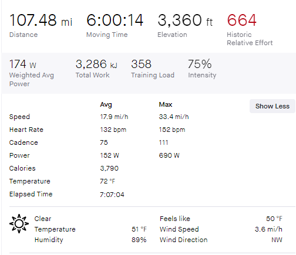

I was able to break this ride into eight segments based on significant circumstances.

## Segment One

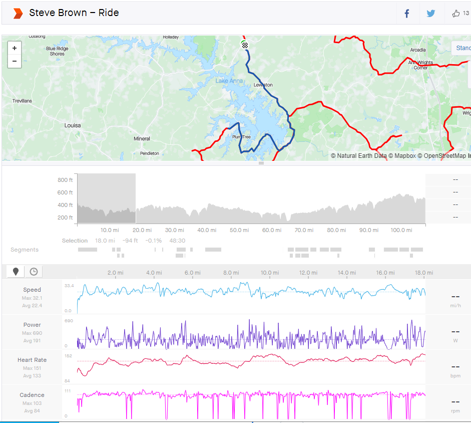

Stage one was a fast adreniline fuled ride right out of the shute. I moved up toward the front relativly early, and although I did not take a turn in the lead, I spent too much time in the two and three spot for a 66 year old. The group passed the first reststop and broke-up somewhat after a hill. I was in the two spot, and the lead was probally putting out too much power. I decieded to wait for Paul and stick with him. Unfortunatly he stopped at the  resetstop and then took a 12 mile deture. I waited for him on the couse quite a while, before going off solo (stage two). I did not know Paul was off in a wrong direction and I waited longer then it would have taken him to get to me, even if he was going slow.  The speed was 22.4 for 18 miles, and it cost me an averave power of 191 watts and a heartrate of 133 bpm. I could have gone further in this situation.

## Segment Two

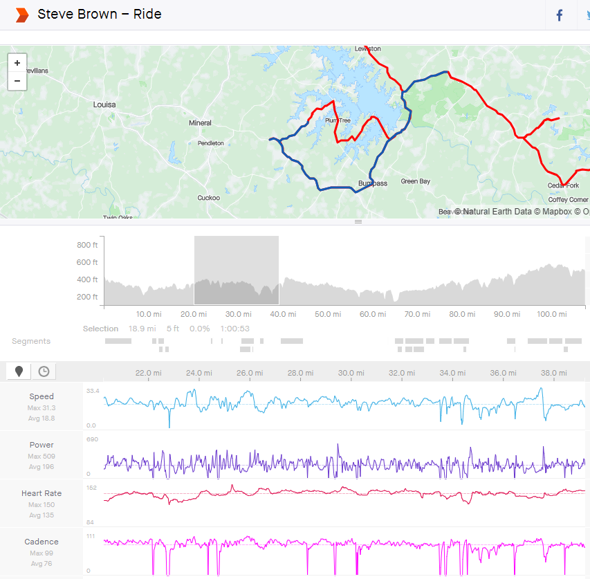

This stage started with a long reset, actually the longest of the ride. This was the time I was waiting for Paul in vein.  Given that I rode the next 19 Miles at 18.8 mph at a cost slightly above the first stage, 196 watts and average 135 heartrate, I'm guessing I could have hung with the fast group up to this point. I would typically consider a solo 19 mile ride at 18.8 pretty good all by itself.

## Segment Three

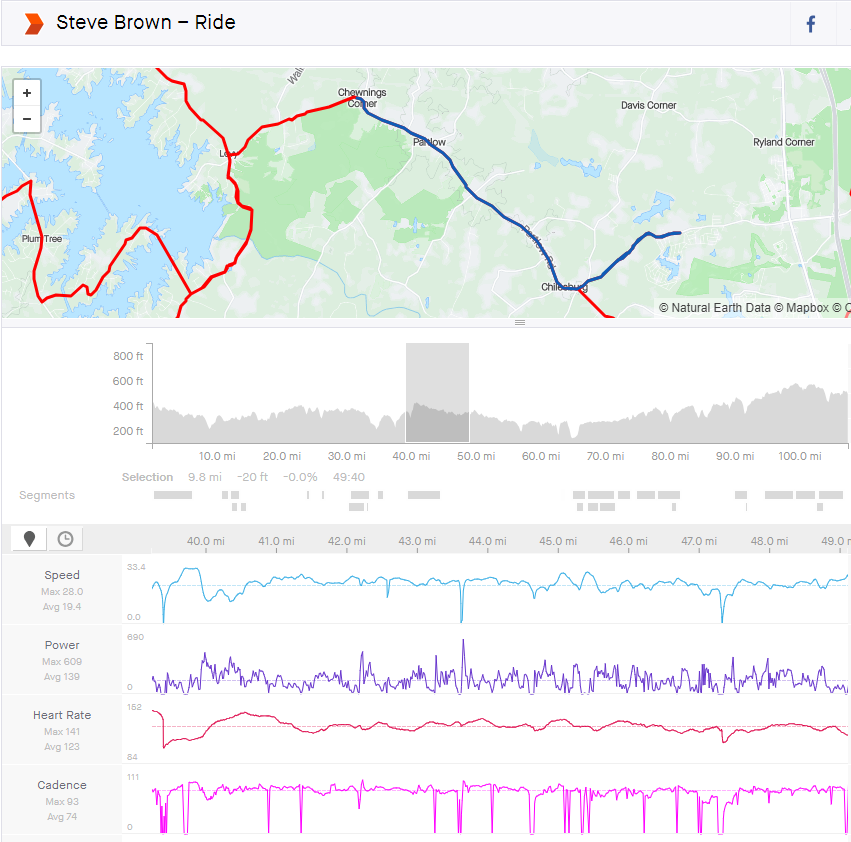

This segment included a missed turn, some time figuring out that we were lost. Paul lead almost all the time and the segment had a slight downgrade after a steep incline. Overall there was zero ellivation. Our speed was 19.4 mph at a power output of 139 watts and a heartrate of 123.  This was easy because paul was doing the work.

## Segment Four

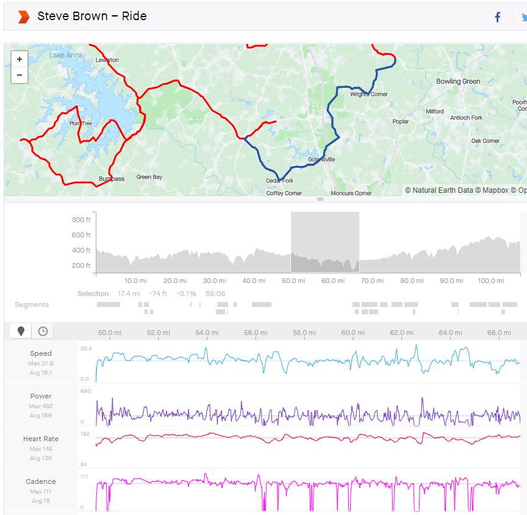

This part of the ride was again a solo effort of 17.4 miles at 18.1 mph expending an average of 166 watts and heart rate of 138 bpm. The topology was a slight decline with a few ups and downs. Given the lower power output and higher HR, it appears the ride is wareing on me at this point in the ride. This segment ends at 67 miles.

## Segment Five

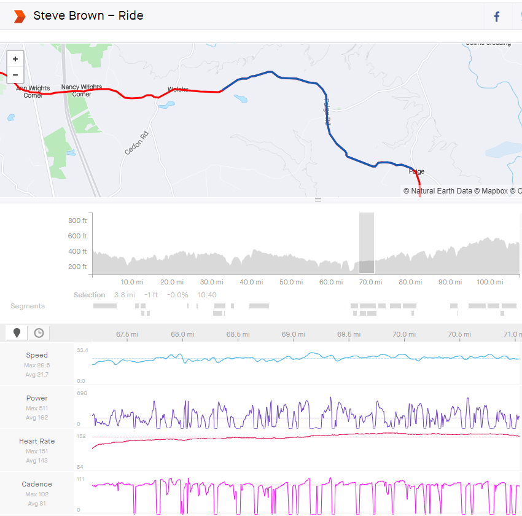

I was tagging along with the KoreanVelo group after the previous rest stop. They were averaging 21.7 mph and it blow me up at this point in the ride, pretty stupid. Power average was 162, not terribly high (Zone 2), but the average HR was 143 (Zone 5 Intervals.icu). This section was only 3.8 miles. The power average was moderate, but there were a lot of high power bursts and coasting in the group. At 71 miles and change.

## Segment Six

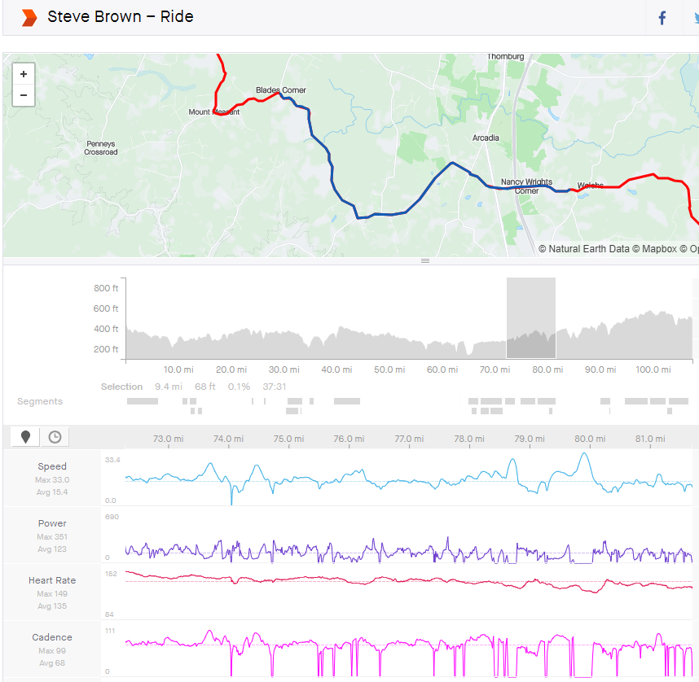

This is were the previous up and down ride with KoreanVelo took its toll.  The next 9.4 miles was riden at a slow speed of 15.4 mph, power was 123 (High Zone 1), and heart rate at 135 (Zone 4). Cadance was also shot, at under 70 rpm. I was cramping and not feeling so good. This was again a solo effort. Ended at about 82 miles.

## Segment Seven

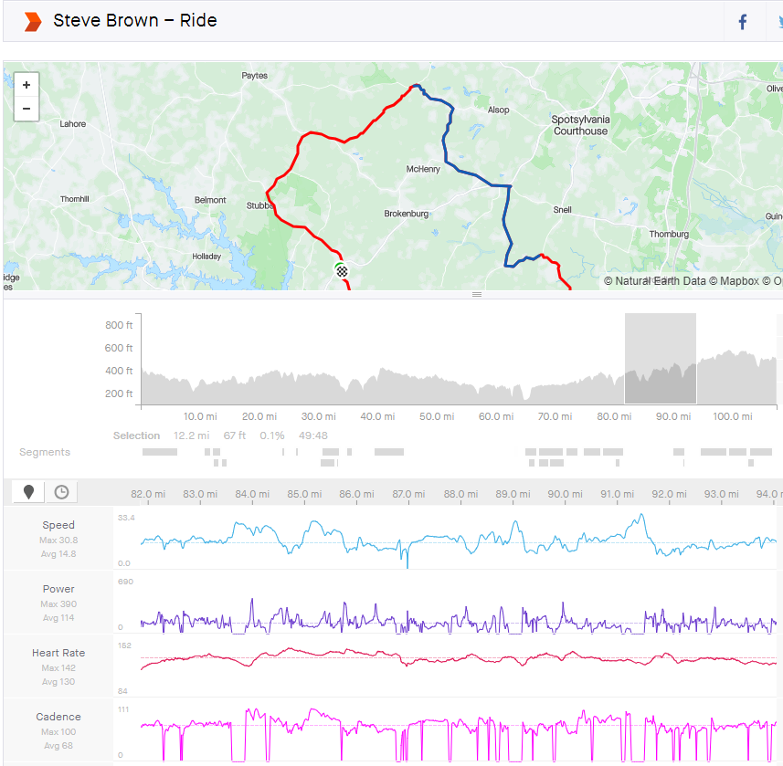

This is simply a continuate of degrigated performance. Speed dropped to a 14.8 mph average, power was down even lower into zone 1 (114), heart rate was down to zone 3 (130) and cadence was still poor, below 70. This ended at about the 94 mile mark.

## Segment Eight

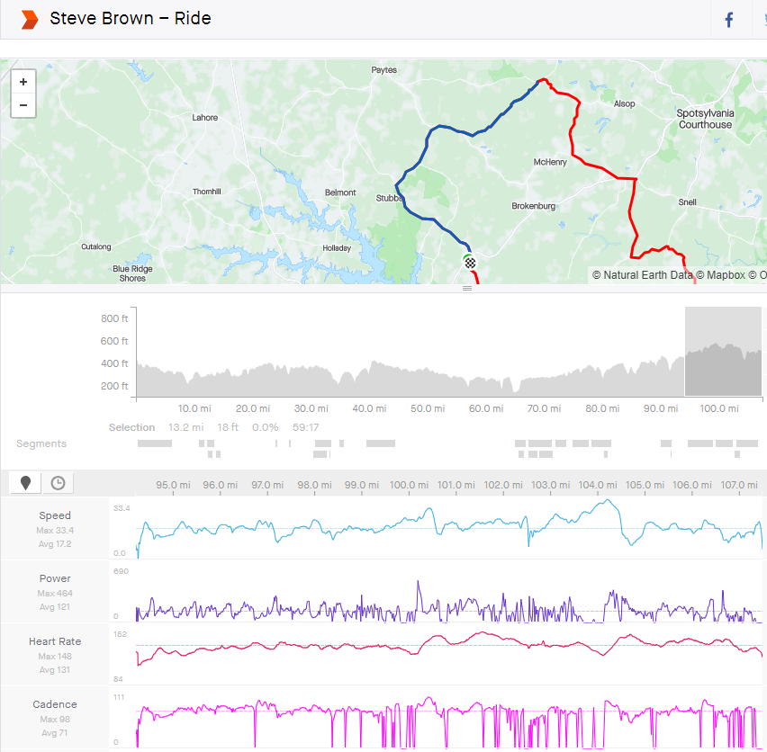

I picked up a group somewhere alon this streach, to get to the finish. I lost contact with the group on the last incline at about 104. The group was pushing the desent and I crampped badly on the incline. Speed was 17.2 power at 121 (Zone 1) and heart rate was zone 3 (131). It looks like the group bought me a little better than 2.4 mph.

# Training

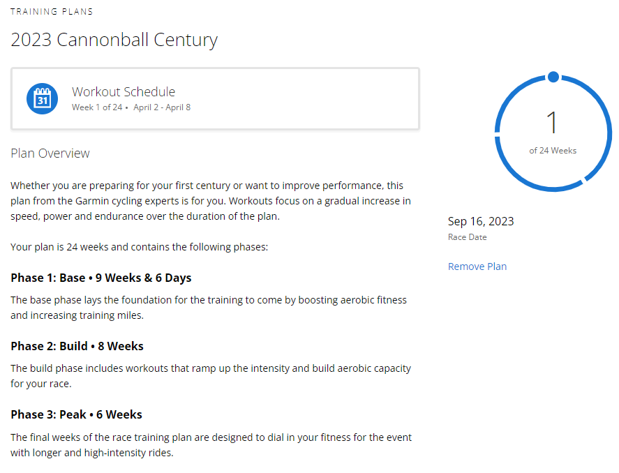

The plan started on April 2 with a 24 week duration. There was little if any dynamic element to the plan other than the calculated FTP on the Garmin device. I was able to complete most of the workouts. Some of the harder workouts, particularly a zone 4 2x15, were a little too much.

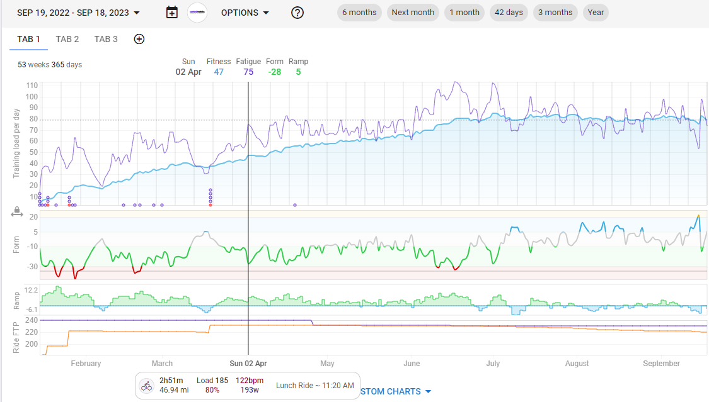

It look like things were going well for the first 12 weeks, that is nine weeks into the base stage and three in the build. Then the build was not happening. This may have been the results of over doing it and a few missed days. I never seemed to get back in the grove, possibly because I was using a static plan. It may be benifical to use the Intervals.icu charts along with the Garmin recommendaions to find the improvement.