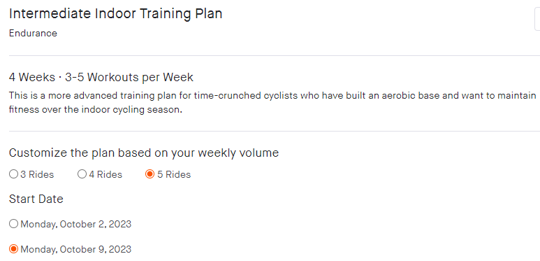
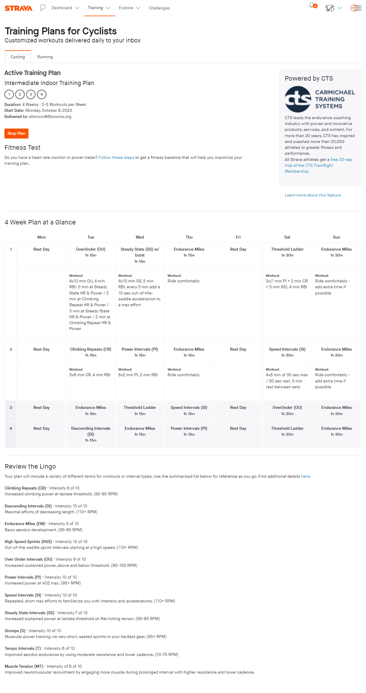

+++
title = 'Training'
date = 2023-10-04T12:58:21-04:00
draft = true
+++
I've tried Xert and SystemX, both were OK, but I wanted to get a base level using the free tools that are available. All training efforts are recored on Garmin Connect and Strava by default, and I can't see this changing. I started with Garmin's "Training Plans"

Garmin's static training plan was used in preparation of the 2023 Cannonball centruy. I inital increases during the base stage, but stagnated during the build phase.  There were performace test in the plan, but it looks like FTP actually decliened during the period. I am keeping this cheap to at a mimium set a base level for any plan or system I may feel will help improve my performance. 

Strava has a number of "plans" based on Carmichael training system, it is not automatically added to the Garmin calendar seems to work by emailing a workout. This may have to be converted into "workouts" in garmin for both recording the progress and riding the workout on the Garmin 530. I will start the "Intermediate Indoor Training Plan" on the 9th of October.

## Performance Metrics

## Garmin 530 Zones

### Heart Rate

| Zone | Low | High | Low % | High % |
|:----:| ----:| ----:| ----:|----:|
| 1 | 102 | 112 | 51% | 60% |
| 2 | 113 | 124 | 60% | 70 % |
| 3 | 125 | 136 | 70% | 80% |
| 4 | 137 | 148 | 80 % | 90% |
| 5 | 149 | 160 | 90% | 100%|

|Zone| Low | %FTP | High |%FTP|
|:----:|----:|----:|----:|----:|
| 1| 0 | 0 | 127| 55% |
|2 | 128 | 54% | 173 | 75% |
| 3 |174 | 76% |207 | 90% |
|4 | 208 | 91% | 242 | 105% |
| 5 | 243 | 106% | 276 | 120% |
| 6 | 278 | 121% | 345 | 150% |
| 7 | >345 | > 150% | | |

